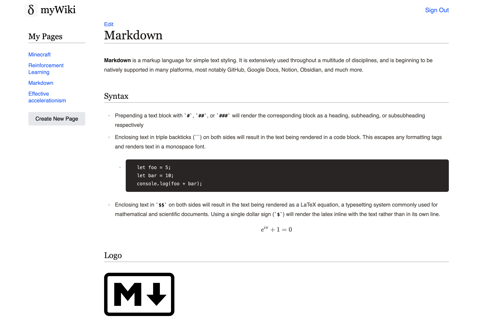

# myWiki

**The encyclopedia of your own knowledge**

**myWiki** is a personal journey to fill out pages of Wikipedia topics with your own knowledge. It helps you build broad and deep understanding on any topics you choose, and gamifies it by adding a sense of progression to the task.

